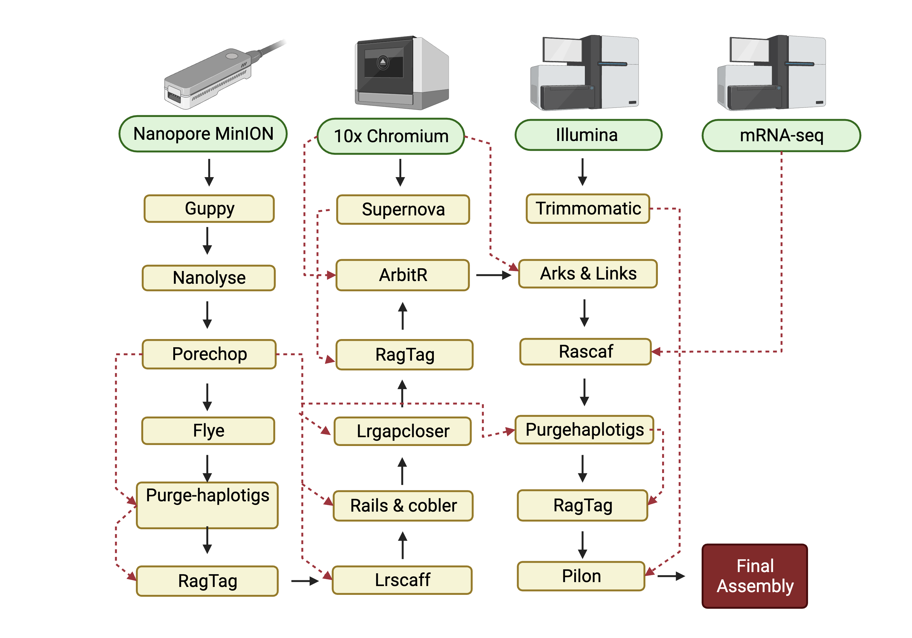

## Sitona obsoletus- whole genome assembly-pipeline

The repository contains all the scripts that I used for assembling the genome of the clover root weevil( Sitona obsoletus) using data from a combination of long read nanopore, 10x genomics and Illumina sequencing technology. The long read assembly from nanopore MinION was used as a primary assembly which is then sccafolded and gap closed using short Illumina reads and 10x linked reads. Schematic representation of my assembly pipeline is given below;



Raw data (fast5) from oxford nanopore MinION was basecalled using Guppy version 5. The script for Guppy is given below.
`Script for Guppy 5`

```
#!/bin/bash -e

#SBATCH --job-name=guppy_crw                 #name of the job
#SBATCH --account=uoo02772              #my project number in nesi
#SBATCH --time=10:00:00                 #wall time
#SBATCH --partition=gpu                 #guppy runs faster in gpu partition in nesi, than other partition
#SBATCH --gres=gpu:1                    #some configuration for gpu partition
#SBATCH --mem=6G                                # memory 6gb
#SBATCH --ntasks=4                              #ntask set to 4
#SBATCH --cpus-per-task=1               #cpu per task set to 1
#SBATCH --output=%x-%j.out              #%x gives job name and %j gives job number, this is slurm output file
#SBATCH --error=%x-%j.err               #similar slurm error file
#SBATCH --mail-type=ALL
#SBATCH --mail-user=katma889@student.otago.ac.nz

module load ont-guppy-gpu/5.0.7
guppy_basecaller -i ../ -s . --flowcell FLO-MIN106 --kit SQK-LSK109 --num_callers 4 -x auto --recursive --trim_barcodes --disable_qscore_filtering

```
Guppy provided us with the merged fastqc files along with the sequencing `summary.txt` file as an input which we process further with pycoQC-2.5.2 to check the quality of our data. It resulted in an interactive html file with details of data quality.

`Script for pycoqc`

```
#!/bin/bash -e

#SBATCH --nodes 1
#SBATCH --cpus-per-task 1
#SBATCH --ntasks 10
#SBATCH --partition=large
#SBATCH --job-name pycoqc
#SBATCH --mem=50G
#SBATCH --time=01:00:00
#SBATCH --account=uoo02772
#SBATCH --output=%x.%j.out
#SBATCH --error=%x.%j.err
#SBATCH --mail-type=ALL
#SBATCH --mail-user=katma889@student.otago.ac.nz
#SBATCH --hint=nomultithread

export PATH="/nesi/nobackup/path/to/bin/miniconda3/bin:$PATH"

pycoQC -f ../sequencing_summary.txt -o pycoQC_output.html

```
After viwing the quality of our output data via html file we further proceed to remove the reads mapping to the lambda phage genome from our fastq files using 'Nanolyse'. This is because we used `DNA CS` while running our sample in the minion flow cells. The script for 'Nanolyse' is given below which was used to remove lambda DNA from our fastq files.

`Script for Nanolyse`

```
#!/bin/bash -e

#SBATCH --nodes 1
#SBATCH --cpus-per-task 1
#SBATCH --ntasks 10
#SBATCH --partition=large
#SBATCH --job-name nanolyse.job
#SBATCH --mem=50G
#SBATCH --time=08:00:00
#SBATCH --account=uoo02752
#SBATCH --output=%x.%j.out
#SBATCH --error=%x.%j.err
#SBATCH --mail-type=ALL
#SBATCH --mail-user=katma889@student.otago.ac.nz
#SBATCH --hint=nomultithread

export PATH="/nesi/nobackup/uoo02752/nematode/bin/miniconda3/bin:$PATH"

cat ../crw.ont.merged.fastq | NanoLyse --reference ./dna_cs.fasta | gzip > crw_nanopore_filtered.fastq.gz

```
Similarly the `dna_cs. fasta` we used in our experiment is given below;

```
DNA_CS
GCCATCAGATTGTGTTTGTTAGTCGCTTTTTTTTTTTGGAATTTTTTTTTTGGAATTTTTTTTTTGCGCTAACAACCTCCTGCCGTTTTGCCCGTGCATATCGGTCACGAACAAATCTGATTACTAAACACAGTAGCCTGGATTTGTTCTATCAGTAATCGACCTTATTCCTAATTAAATAGAGCAAATCCCCTTATTGGGGGTAAGACATGAAGATGCCAGAAAAACATGACCTGTTGGCCGCCATTCTCGCGGCAAAGGAACAAGGCATCGGGGCAATCCTTGCGTTTGCAATGGCGTACCTTCGCGGCAGATATAATGGCGGTGCGTTTACAAAAACAGTAATCGACGCAACGATGTGCGCCATTATCGCCTAGTTCATTCGTGACCTTCTCGACTTCGCCGGACTAAGTAGCAATCTCGCTTATATAACGAGCGTGTTTATCGGCTACATCGGTACTGACTCGATTGGTTCGCTTATCAAACGCTTCGCTGCTAAAAAAGCCGGAGTAGAAGATGGTAGAAATCAATAATCAACGTAAGGCGTTCCTCGATATGCTGGCGTGGTCGGAGGGAACTGATAACGGACGTCAGAAAACCAGAAATCATGGTTATGACGTCATTGTAGGCGGAGAGCTATTTACTGATTACTCCGATCACCCTCGCAAACTTGTCACGCTAAACCCAAAACTCAAATCAACAGGCGCCGGACGCTACCAGCTTCTTTCCCGTTGGTGGGATGCCTACCGCAAGCAGCTTGGCCTGAAAGACTTCTCTCCGAAAAGTCAGGACGCTGTGGCATTGCAGCAGATTAAGGAGCGTGGCGCTTTACCTATGATTGATCGTGGTGATATCCGTCAGGCAATCGACCGTTGCAGCAATATCTGGGCTTCACTGCCGGGCGCTGGTTATGGTCAGTTCGAGCATAAGGCTGACAGCCTGATTGCAAAATTCAAAGAAGCGGGCGGAACGGTCAGAGAGATTGATGTATGAGCAGAGTCACCGCGATTATCTCCGCTCTGGTTATCTGCATCATCGTCTGCCTGTCATGGGCTGTTAATCATTACCGTGATAACGCCATTACCTACAAAGCCCAGCGCGACAAAAATGCCAGAGAACTGAAGCTGGCGAACGCGGCAATTACTGACATGCAGATGCGTCAGCGTGATGTTGCTGCGCTCGATGCAAAATACACGAAGGAGTTAGCTGATGCTAAAGCTGAAAATGATGCTCTGCGTGATGATGTTGCCGCTGGTCGTCGTCGGTTGCACATCAAAGCAGTCTGTCAGTCAGTGCGTGAAGCCACCACCGCCTCCGGCGTGGATAATGCAGCCTCCCCCCGACTGGCAGACACCGCTGAACGGGATTATTTCACCCTCAGAGAGAGGCTGATCACTATGCAAAAACAACTGGAAGGAACCCAGAAGTATATTAATGAGCAGTGCAGATAGAGTTGCCCATATCGATGGGCAACTCATGCAATTATTGTGAGCAATACACACGCGCTTCCAGCGGAGTATAAATGCCTAAAGTAATAAAACCGAGCAATCCATTTACGAATGTTTGCTGGGTTTCTGTTTTAACAACATTTTCTGCGCCGCCACAAATTTTGGCTGCATCGACAGTTTTCTTCTGCCCAATTCCAGAAACGAAGAAATGATGGGTGATGGTTTCCTTTGGTGCTACTGCTGCCGGTTTGTTTTGAACAGTAAACGTCTGTTGAGCACATCCTGTAATAAGCAGGGCCAGCGCAGTAGCGAGTAGCATTTTTTTCATGGTGTTATTCCCGATGCTTTTTGAAGTTCGCAGAATCGTATGTGTAGAAAATTAAACAAACCCTAAACAATGAGTTGAAATTTCATATTGTTAATATTTATTAATGTATGTCAGGTGCGATGAATCGTCATTGTATTCCCGGATTAACTATGTCCACAGCCCTGACGGGGAACTTCTCTGCGGGAGTGTCCGGGAATAATTAAAACGATGCACACAGGGTTTAGCGCGTACACGTATTGCATTATGCCAACGCCCCGGTGCTGACACGGAAGAAACCGGACGTTATGATTTAGCGTGGAAAGATTTGTGTAGTGTTCTGAATGCTCTCAGTAAATAGTAATGAATTATCAAAGGTATAGTAATATCTTTTATGTTCATGGATATTTGTAACCCATCGGAAAACTCCTGCTTTAGCAAGATTTTCCCTGTATTGCTGAAATGTGATTTCTCTTGATTTCAACCTATCATAGGACGTTTCTATAAGATGCGTGTTTCTTGAGAATTTAACATTTACAACCTTTTTAAGTCCTTTTATTAACACGGTGTTATCGTTTTCTAACACGATGTGAATATTATCTGTGGCTAGATAGTAAATATAATGTGAGACGTTGTGACGTTTTAGTTCAGAATAAAACAATTCACAGTCTAAATCTTTTCGCACTTGATCGAATATTTCTTTAAAAATGGCAACCTGAGCCATTGGTAAAACCTTCCATGTGATACGAGGGCGCGTAGTTTGCATTATCGTTTTTATCGTTTCAATCTGGTCTGACCTCCTTGTGTTTTGTTGATGATTTATGTCAAATATTAGGAATGTTTTCACTTAATAGTATTGGTTGCGTAACAAAGTGCGGTCCTGCTGGCATTCTGGAGGGAAATACAACCGACAGATGTATGTAAGGCCAACGTGCTCAAATCTTCATACAGAAAGATTTGAAGTAATATTTTAACCGCTAGATGAAGAGCAAGCGCATGGAGCGACAAAATGAATAAAGAACAATCTGCTGATGATCCCTCCGTGGATCTGATTCGTGTAAAAAATATGCTTAATAGCACCATTTCTATGAGTTACCCTGATGTTGTAATTGCATGTATAGAACATAAGGTGTCTCTGGAAGCATTCAGAGCAATTGAGGCAGCGTTGGTGAAGCACGATAATAATATGAAGGATTATTCCCTGGTGGTTGACTGATCACCATAACTGCTAATCATTCAAACTATTTAGTCTGTGACAGAGCCAACACGCAGTCTGTCACTGTCAGGAAAGTGGTAAAACTGCAACTCAATTACTGCAATGCCCTCGTAATTAAGTGAATTTACAATATCGTCCTGTTCGGAGGGAAGAACGCGGGATGTTCATTCTTCATCACTTTTAATTGATGTATATGCTCTCTTTTCTGACGTTAGTCTCCGACGGCAGGCTTCAATGACCCAGGCTGAGAAATTCCCGGACCCTTTTTGCTCAAGAGCGATGTTAATTTGTTCAATCATTTGGTTAGGAAAGCGGATGTTGCGGGTTGTTGTTCTGCGGGTTCTGTTCTTCGTTGACATGAGGTTGCCCCGTATTCAGTGTCGCTGATTTGTATTGTCTGAAGTTGTTTTTACGTTAAGTTGATGCAGATCAATTAATACGATACCTGCGTCATAATTGATTATTTGACGTGGTTTGATGGCCTCCACGCACGTTGTGATATGTAGATGATAATCATTATCACTTTACGGGTCCTTTCCGGTGAAAAAAAAGGTACCAAAAAAAACATCGTCGTGAGTAGTGAACCGTAAGC

```

As basecalling with Guppy only resulted in removal of adapters attached to the end of the reads. Therefore, 'Porechop' was used to remove any remaining adapters present in the middle of our reads. The scrpit for 'Porechop' is given below;

`Script for Porechop`

```
#!/bin/bash -e

#SBATCH --nodes 1
#SBATCH --cpus-per-task 1
#SBATCH --ntasks 10
#SBATCH --partition=large
#SBATCH --job-name porechop
#SBATCH --mem=50G
#SBATCH --time=04:00:00
#SBATCH --account=uoo02772
#SBATCH --output=%x.%j.out
#SBATCH --error=%x.%j.err
#SBATCH --mail-type=ALL
#SBATCH --mail-user=bhaup057@student.otago.ac.nz
#SBATCH --hint=nomultithread

module load Porechop/0.2.4-gimkl-2020a-Python-3.8.2
porechop -i ../crw_nanopore_filtered.fastq.gz -o crw_ont_nanolyse_porechop.fastq.gz --threads 10

```
Among different assemblers that were tried for assefor Nanopore Long reads,`FLye` gave the best assembly, Therefore We used `FLye`2.9 version to assemble the long read data from Oxford Minion. The script for `flye` assembly algorithm is given below;

Script for Flye 

```
#!/bin/bash -e

#SBATCH --nodes 1
#SBATCH --cpus-per-task 1
#SBATCH --ntasks 10
#SBATCH --partition=hugemem
#SBATCH --job-name flye.crwV3
#SBATCH --mem=150G
#SBATCH --time=72:00:00
#SBATCH --account=uoo02772
#SBATCH --output=%x_%j.out
#SBATCH --error=%x_%j.err
#SBATCH --mail-type=ALL
#SBATCH --mail-user=katma889@student.otago.ac.nz
#SBATCH --hint=nomultithread

module load Flye/2.9-gimkl-2020a-Python-3.8.2

flye --nano-hq ../crw_ont_nanolyse_porechop_nanofilt.fastq.gz -o ./Flye -t 10 -i 3 

```
This Flye output also includes a main file `assembly.fasta` which was further used for running the `Quast`. Quast is usually used to evaluate the assembly quality even in the absence of a reference genome. The script of `Quast` is given below;

`Script for Quast`

```
#!/bin/bash -e

#SBATCH --nodes 1
#SBATCH --cpus-per-task 1
#SBATCH --ntasks 6
#SBATCH --partition=large
#SBATCH --job-name quast.crw
#SBATCH --mem=30G
#SBATCH --time=09:00:00
#SBATCH --account=uoo02772
#SBATCH --output=%x_%j.out
#SBATCH --error=%x_%j.err
#SBATCH --mail-type=ALL
#SBATCH --mail-user=katma889@student.otago.ac.nz
#SBATCH --hint=nomultithread

module load QUAST
#=========> running quast for assembly quality

quast.py -t 10 --eukaryote --large --conserved-genes-finding --k-mer-stats \
assembly.fasta \
-o quast 

```
By running the above script it yielded a `quast` folder wwhich yielded a main file called 'report.txt'.
The above mentioned 'report.txt' yielded us  the Complete BUSCO and partial BUSCO percentage and also the number of contigs along with other assembly statistics.
Then we used `Purgehaplotigs` to remove the haplotigs from our assembly. It helps us to to identify and reassign the duplicate contigs to improve our assembly. The script that we ran is given below;

`Script for Purgehaplotigs`

```
#!/bin/bash -e

#SBATCH --nodes 1
#SBATCH --cpus-per-task 1
#SBATCH --ntasks 10
#SBATCH --job-name purgehap.crw
#SBATCH --mem=80G
#SBATCH --time=24:00:00
#SBATCH --account=uoo02772
#SBATCH --output=%x_%j.out
#SBATCH --error=%x_%j.err
#SBATCH --mail-type=ALL
#SBATCH --mail-user=katma889@student.otago.ac.nz
#SBATCH --hint=nomultithread

module load SAMtools/1.12-GCC-9.2.0
module load minimap2/2.20-GCC-9.2.0
module load BEDTools/2.29.2-GCC-9.2.0

#minimap2 -t 10 -ax map-ont assembly.fasta crw_ont_nanolyse_porechop_nanofilt.fastq.gz \
#--secondary=no | samtools sort -m 5G -o aligned.bam -T tmp.ali

export PATH="/nesi/nobackup/uoo02772/bin/miniconda3/bin:$PATH"
#purge_haplotigs hist -b aligned.bam -g assembly.fasta -t 10

#purge_haplotigs cov -i aligned.bam.gencov -l 0 -m 20 -h 199 -o coverage_stats.csv

purge_haplotigs purge -g assembly.fasta -c coverage_stats.csv -b aligned.bam

#awk '{print $1",s,"}' gapclosed.fasta.pilon3.fasta.fai > cov_stat.csv
#purge_haplotigs purge -g gapclosed.fasta.pilon3.fasta -c cov_stat.csv -b aligned.bam

```
This yielded us the file called `curated.fasta` which we further ran quast on it. This `purge haplotigs` bring down the contigs number to -51390 from 82815. However, the complete BUSCO percent was sligthly reduded to 90.10 and little increase on partial BUSCO to 6.27. Therefore we further used the `RagTag` algorithm  a toolset for automating assembly scaffolding and patching our long read assembly. The script for `RAgTag` is given below;

`Script for RagTag`

```
#!/bin/bash -e

#SBATCH --nodes 1
#SBATCH --cpus-per-task 1
#SBATCH --ntasks 10
#SBATCH --job-name ragtag.crw
#SBATCH --mem=8G
#SBATCH --time=04:00:00
#SBATCH --account=uoo02772
#SBATCH --output=%x_%j.out
#SBATCH --error=%x_%j.err
#SBATCH --mail-type=ALL
#SBATCH --mail-user=katma889@student.otago.ac.nz
#SBATCH --hint=nomultithread

export PATH="/nesi/nobackup/uoo02772/path to/bin/miniconda3/bin:$PATH"

ragtag.py scaffold curated.haplotigs.fasta curated.fasta

```
By running above script we got `ragtag.scaffold.fasta` as our main output and we can check the stats file ( for example ragtag.scaffold.stats) to see  the number of scaffold it removed. Our result is given below;


We further ran 'Quast' in the output file from ragtag that is `ragtag.scaffold.fasta` and it further reduced to number of contigs.

Then we used `lrscaff` to further scaffold the assembly from ragtag using long reads that is `crw_ont_nanolyse_porechop_nanofilt.fasta` in our case. The script for `lrscaff` is given below;

`Script for LRScaff`

```
#!/bin/bash -e

#SBATCH --nodes 1
#SBATCH --cpus-per-task 1
#SBATCH --ntasks 10
#SBATCH --job-name lrscaf.crw
#SBATCH --mem=80G
#SBATCH --time=72:00:00
#SBATCH --account=uoo02772
#SBATCH --output=%x_%j.out
#SBATCH --error=%x_%j.err
#SBATCH --mail-type=ALL
#SBATCH --mail-user=katma889@student.otago.ac.nz
#SBATCH --hint=nomultithread

module load minimap2

minimap2 -t 10 ragtag.scaffold.fasta crw_ont_nanolyse_porechop_nanofilt.fasta > ./aln.mm
export PATH="/nesi/nobackup/uoo02752/bin/lrscaf/target/:$PATH"

java -Xms80g -Xmx80g -jar /nesi/nobackup/uoo02752/bin/lrscaf/target/LRScaf-1.1.11.jar --contig ragtag.scaffold.fasta --alignedFile aln.mm -t mm -p 10 --output ./scaffolds1

minimap2 -t 10 ./scaffolds1/scaffolds.fasta crw_ont_nanolyse_porechop_nanofilt.fasta > ./scaffolds1/aln.mm
export PATH="/nesi/nobackup/uoo02752/bin/lrscaf/target/:$PATH"

java -Xms80g -Xmx80g -jar /nesi/nobackup/uoo02752/bin/lrscaf/target/LRScaf-1.1.11.jar --contig ./scaffolds1/scaffolds.fasta --alignedFile ./scaffolds1/aln.mm -t mm -p 10 --output ./scaffolds1/scaffolds2

minimap2 -t 10 ./scaffolds1/scaffolds2/scaffolds.fasta crw_ont_nanolyse_porechop_nanofilt.fasta > ./scaffolds1/scaffolds2/aln.mm
export PATH="/nesi/nobackup/uoo02752/bin/lrscaf/target/:$PATH"

java -Xms80g -Xmx80g -jar /nesi/nobackup/uoo02752/bin/lrscaf/target/LRScaf-1.1.11.jar --contig ./scaffolds1/scaffolds2/scaffolds.fasta --alignedFile ./scaffolds1/scaffolds2/aln.mm -t mm -p 10 --output ./scaffolds1/scaffolds2/scaffolds3

minimap2 -t 10 ./scaffolds1/scaffolds2/scaffolds3/scaffolds.fasta crw_ont_nanolyse_porechop_nanofilt.fasta > ./scaffolds1/scaffolds2/scaffolds3/aln.mm
export PATH="/nesi/nobackup/uoo02752/bin/lrscaf/target/:$PATH"

java -Xms80g -Xmx80g -jar /nesi/nobackup/uoo02752/bin/lrscaf/target/LRScaf-1.1.11.jar --contig ./scaffolds1/scaffolds2/scaffolds3/scaffolds.fasta --alignedFile ./scaffolds1/scaffolds2/scaffolds3/aln.mm -t mm -p 10 --output ./scaffolds1/scaffolds2/scaffolds3/scaffolds4

minimap2 -t 10 ./scaffolds1/scaffolds2/scaffolds3/scaffolds4/scaffolds.fasta crw_ont_nanolyse_porechop_nanofilt.fasta > ./scaffolds1/scaffolds2/scaffolds3/scaffolds4/aln.mm
export PATH="/nesi/nobackup/uoo02752/bin/lrscaf/target/:$PATH"

java -Xms80g -Xmx80g -jar /nesi/nobackup/uoo02752/bin/lrscaf/target/LRScaf-1.1.11.jar --contig ./scaffolds1/scaffolds2/scaffolds3/scaffolds4/scaffolds.fasta --alignedFile ./scaffolds1/scaffolds2/scaffolds3/scaffolds4/aln.mm -t mm -p 10 --output ./scaffolds1/scaffolds2/scaffolds3/scaffolds4/scaffolds5
```

We checked the output from the `lrscaff` from quast and `scaffolds5_scaffolds` resulted in the further reduction in the number of contigs.

We further scaffold our genome usimng long DNA sequences from ONT `crw_ont_nanolyse_porechop_nanofilt.fasta` using `RAILS v1.5.1` and `Cobbler v0.6.1` Here `RAIlS` is known as all-in -one scaffolder and gap-filler whereas Cobbler is tool that patch gaps automatically. The script used for this is given below;

`Script for RAILS and Cobbler`

```
#!/bin/bash -e

#SBATCH --nodes 1
#SBATCH --cpus-per-task 1
#SBATCH --ntasks 10
#SBATCH --job-name rails.cob.crw
#SBATCH --mem=50G
#SBATCH --time=72:00:00
#SBATCH --account=uoo02772
#SBATCH --output=%x_%j.out
#SBATCH --error=%x_%j.err
#SBATCH --mail-type=ALL
#SBATCH --mail-user=katma889@student.otago.ac.nz
#SBATCH --hint=nomultithread

module load Perl/5.30.1-GCC-9.2.0
module load minimap2
module load SAMtools/1.13-GCC-9.2.0
export PATH="/nesi/nobackup/uoo02752/nematode/bin/RAILS/bin:$PATH"

sh runRAILSminimapSTREAM.sh scaffolds.fasta crw_ont_nanolyse_porechop_nanofilt.fasta 250 0.80 500 2 ont \
/scale_wlg_persistent/filesets/opt_nesi/CS400_centos7_bdw/SAMtools/1.13-GCC-9.2.0/bin/samtools 10

```

By running the script given above first we will get the output of cobbler as `crw_ont_nanolyse_porechop_nanofilt.fasta_vs_scaffolds.fasta_250_0.80_gapsFill.fa` in my case which was further used by `RAILS` to get the final output as `crw_ont_nanolyse_porechop_nanofilt.fasta_vs_scaffolds.fasta_250_0.80_rails.scaffolds.fa` at the end. 
*0 bp gaps are not counted towards the average
crw_ont_nanolyse_porechop_nanofilt.fasta_vs_scaffolds.fasta_250_0.80_rails.log 

We then ran `Quast` for the output file from the rails to evaluate the assembly quality parameters.

Then we further used the LRScaff to further boost the contiguity of our assemly using MinION long filetered reads.The script for `LRScaff` is given below;

`script for LRScaff`

```
#!/bin/bash -e

#SBATCH --nodes 1
#SBATCH --cpus-per-task 1
#SBATCH --ntasks 16
#SBATCH --job-name lr-gapEW
#SBATCH --mem=40G
##SBATCH --time=00:15:00
#SBATCH --time=50:00:00
#SBATCH --account=uoo02752
#SBATCH --output=%x_%j.out
#SBATCH --error=%x_%j.err
#SBATCH --mail-type=ALL
#SBATCH --mail-user=katma889@student.otago.ac.nz
#SBATCH --hint=nomultithread

module load BWA/0.7.17-gimkl-2017a
export PATH=/nesi/nobackup/uoo02752/bin/LR_Gapcloser/src/:$PATH

sh LR_Gapcloser.sh -i crw.scaffolds.fasta -l crw_ont_nanolyse_porechop_nanofilt.fasta -s n -t 16 -r 10
```

By running above script we got iteration -1 to iteration-10 folders with the common filename `gapclosed.fasta` in each of them. Then we ran quast (iteration10) to check the quality of the assembly, LRScaff reduced gaps (N's per 100 kbp) in our case using `crw_ont_nanolyse_porechop_nanofilt.fasta` for gap filling.

We further scaffold the output `gapclosed.fasta` by our supernova assembly from 10X `scaffold crw.10x.all.pseudo.fasta` from ragtag. 

`Script for ragtag`

```
#!/bin/bash -e

#SBATCH --nodes 1
#SBATCH --cpus-per-task 1
#SBATCH --ntasks 10
#SBATCH --job-name ragtag.10x
#SBATCH --mem=50G
#SBATCH --time=05:00:00
#SBATCH --account=uoo02772
#SBATCH --output=%x_%j.out
#SBATCH --error=%x_%j.err
#SBATCH --mail-type=ALL
#SBATCH --mail-user=katma889@student.otago.ac.nz
#SBATCH --hint=nomultithread

export PATH="/nesi/nobackup/uoo02752/nematode/bin/miniconda3/bin:$PATH"

ragtag.py scaffold crw.10x.all.pseudo.fasta gapclosed.fasta
```
By running above script we got `ragtag.scaffold.fasta` as output file which we further used for scafollding agian using `ragtag`. We renamed this output as `assembly.fasta` and also changed the sequence header to make it compatible to use in scaffolding using ragtag. The script for ragtag for second times is same except using `assembly.fasta` instead of `gapclosed.fasta`. By running the ragtag script this time we used `ragtag.scaffold.fasta` 

We further used `ARBitR` for further merging and scaffolding our current genome assembly from ragtag. As it takes alignment file in the bam/sam format (for example possorted_bam.bam in our case)  with 10X Chromium barcodes when provided with genome fasta file used for mapping, it will sort and merge the provided contigs into scaffolds. Therefore, first we created a reference data `ragtag.scaffold.fasta` and alignment in the folder id CRW using `longranger` to be used by the `ARBitR`. 

`Script for longranger`

```
#!/bin/bash -e

#SBATCH --nodes 1
#SBATCH --cpus-per-task 1
#SBATCH --ntasks 10
#SBATCH --job-name longR_CRW
#SBATCH --mem=50G
#SBATCH --time=72:00:00
#SBATCH --account=uoo02772
#SBATCH --output=%x_%j.out
#SBATCH --error=%x_%j.err
#SBATCH --mail-type=ALL
#SBATCH --mail-user=katma889@student.otago.ac.nz
#SBATCH --hint=nomultithread

export PATH=/nesi/project/uoo02752/bin/longranger-2.2.2:$PATH

#longranger mkref ragtag.scaffold.fasta

longranger align --id=CRW \
--fastqs=/nesi/nobackup/uoo02772/crw/10x/1.raw.hiseq.novaseq \
--reference=/nesi/nobackup/uoo02772/crw/2.nanopore/1.CRW_nanopore_rawdata/guppy.5/nanolyse/porechop/nanoqc/nanofilt/flye/Flye/purgehaplotigs/ragtag_output/lrscaff/scaffolds1/scaffolds2/scaffolds3/scaffolds4/scaffolds5/rails.cobbler/lrgapcloser/Output/sn.10x.ragtag/ragtag_output/ragtag.2/ragtag_output/arbitr/refdata-ragtag.scaffold
```
Then we ran ARBitR on the aligned scaffold fasta file using `possorted_bam.bam`.

`Script for ARBitR`

```
#!/bin/bash -e

#SBATCH --nodes 1
#SBATCH --cpus-per-task 1
#SBATCH --ntasks 10
#SBATCH --job-name arbitr.crw
#SBATCH --mem=5G
#SBATCH --time=05:00:00
#SBATCH --account=uoo02772
#SBATCH --output=%x_%j.out
#SBATCH --error=%x_%j.err
#SBATCH --mail-type=ALL
#SBATCH --mail-user=katma889@student.otago.ac.nz
#SBATCH --hint=nomultithread

export PATH="/nesi/nobackup/uoo02752/nematode/bin/ARBitR/src:$PATH"
export PATH="/nesi/nobackup/uoo02752/nematode/bin/miniconda3/bin:$PATH"

arbitr.py -i ragtag.scaffold.fasta -o output.arbitr.scaffolds ./CRW/outs/possorted_bam.bam

```
We further ran arks on the output from the above script.

`Script for arks`

```
#!/bin/bash -e

#SBATCH --nodes 1
#SBATCH --cpus-per-task 1
#SBATCH --ntasks 16
##SBATCH --qos=debug
#SBATCH --job-name arks.crw
#SBATCH --mem=50G
#SBATCH --time=72:00:00
##SBATCH --time=00:15:00
#SBATCH --account=uoo02772
#SBATCH --output=%x_%j.out
#SBATCH --error=%x_%j.err
#SBATCH --mail-type=ALL
#SBATCH --mail-user=katma889@student.otago.ac.nz
#SBATCH --hint=nomultithread

module load BWA/0.7.17-GCC-9.2.0
module load SAMtools/1.13-GCC-9.2.0
module load BEDTools/2.29.2-GCC-9.2.0
module load LINKS/1.8.7-GCC-9.2.0
export PATH=/nesi/nobackup/uoo02752/CRW/CRW_nanopore/0.all_fast5/gupppy.5/pycoqc/nanolyse/porechop/nanoqc/flye/crw_flye/purgehaplotigs/lrscaff/scaffolds1/scaffolds2/scaffolds3/scaffolds4/scaffolds5/lrgapcloser/Output/rails.cobler/ragtag/ragtag_output/arbitr/arbitr.default/arbitr.2/arcs.links/arks-1.0.4/Examples:$PATH
export PATH=/nesi/nobackup/uoo02752/nematode/nematode_nanopore/0.all_fast5/gupppy.5/pycoqc/nanolyse/porechop/nanoqc/flye/M.neg_flye/purgehaplotigs/lrscaff/scaffolds1/scaffolds2/scaffolds3/scaffolds4/scaffolds5/lrgapcloser/Output/rails.cobler/ragtag/ragtag_output/arbitr/arbitr.default/arbitr.2/arcs.links/arks-1.0.4/Arks:$PATH

arks-make arks draft=output.arbitr.scaffolds reads=barcoded threads=16

```

Then we ran `arks`  version 1.1.0 to scaffold the genome assemblies produced by arbirr using our 10X Chromium Genomics reads. 

`Scripts for arks`

```
(base) [katma889@mahuika01 arks]$ less arks.sl

#!/bin/bash -e

#SBATCH --nodes 1
#SBATCH --cpus-per-task 1
#SBATCH --ntasks 16
##SBATCH --qos=debug
#SBATCH --job-name arks.crw
#SBATCH --mem=50G
#SBATCH --time=72:00:00
##SBATCH --time=00:15:00
#SBATCH --account=uoo02772
#SBATCH --output=%x_%j.out
#SBATCH --error=%x_%j.err
#SBATCH --mail-type=ALL
#SBATCH --mail-user=katma889@student.otago.ac.nz
#SBATCH --hint=nomultithread

module load BWA/0.7.17-GCC-9.2.0
module load SAMtools/1.13-GCC-9.2.0
module load BEDTools/2.29.2-GCC-9.2.0
module load LINKS/1.8.7-GCC-9.2.0
export PATH=/nesi/nobackup/uoo02752/nematode/nematode_nanopore/0.all_fast5/gupppy.5/pycoqc/nanolyse/porechop/nanoqc/flye/M.neg_flye/purgehaplotigs/lrscaff/scaffolds1/scaffolds2/scaffolds3/scaffolds4/scaffolds5/lrgapcloser/Output/rails.cobler/ragtag/ragtag_output/arbitr/arbitr.default/arbitr.2/arcs.links/arks-1.0.4/Examples:$PATH
export PATH=/nesi/nobackup/uoo02752/nematode/nematode_nanopore/0.all_fast5/gupppy.5/pycoqc/nanolyse/porechop/nanoqc/flye/M.neg_flye/purgehaplotigs/lrscaff/scaffolds1/scaffolds2/scaffolds3/scaffolds4/scaffolds5/lrgapcloser/Output/rails.cobler/ragtag/ragtag_output/arbitr/arbitr.default/arbitr.2/arcs.links/arks-1.0.4/Arks:$PATH

arks-make arks draft=output.arbitr.scaffolds reads=barcoded threads=16

```
Then we used `Rascaf`to improve the assembly from above using our PE RNA-seq data. This will enable us to imrove our long-range contiguity and order information from intron-spanning RNA-seq read pairs to improve our draft assembly particularly in gene regions. Therefore we imorted merged fq files for Our PE mRNA-seq reads (`merge.R1.fq` and `merge.R2.fq` . Before running the `Rascaf` we first need to align our RNA-seq reads mapping into our genome using `Hisat2`. 

`Script for Hisat2`

```
#!/bin/bash -e

#SBATCH --job-name=hisat.mRNA.crw
#SBATCH --account=uoo02772
#SBATCH --nodes 1
#SBATCH --cpus-per-task 1
#SBATCH --ntasks 10
#SBATCH --mem=40G
##SBATCH --qos=debug
##SBATCH --time=00:15:00
#SBATCH --time=20:00:00
#SBATCH --output=%x.%j.out
#SBATCH --error=%x.%j.err
#SBATCH --mail-type=All
#SBATCH --mail-user=katma889@student.otago.ac.nz
#SBATCH --hint=nomultithread

module load HISAT2/2.2.1-gimkl-2020a
module load Python/3.9.5-gimkl-2020a
module load SAMtools/1.13-GCC-9.2.0

hisat2-build -p 10 output.arbitr.scaffolds_c4_m50-10000_k100_r0.05_e30000_z1000_l2_a0.9.scaffolds.fa$

mkdir alignment
hisat2 -x hisat2.RNA.crw -1 ./crw-merged-RNAseq/merge.R1.fq -2 ./crw-merged-RNAseq/merge.R2.fq -S ali$
samtools view -bS alignment/crw_mRNA_alignment.sam > alignment/crw_mRNA_alignment.bam
samtools sort alignment/crw_mRNA_alignment.bam -o alignment/crw_mRNA_alignment_sorted.bam

```
This gave us the result in `SAM` file which is then converted to `BAM` which is further converted into `sorted BAM` as the final output to be use in our further assembly process using Rescaf.

`Script for rascaf`

```
#!/bin/bash -e

#SBATCH --job-name=rascaf.crw
#SBATCH --account=uoo02772
#SBATCH --nodes 1
#SBATCH --cpus-per-task 1
#SBATCH --ntasks 10
#SBATCH --mem=5G
##SBATCH --qos=debug
##SBATCH --time=00:15:00
#SBATCH --time=08:00:00
#SBATCH --output=%x.%j.out
#SBATCH --error=%x.%j.err
#SBATCH --mail-type=All
#SBATCH --mail-user=katma889@student.otago.ac.nz
#SBATCH --hint=nomultithread

export PATH=/nesi/nobackup/uoo02752/nematode/bin/rascaf:$PATH

rascaf -b ../crw_mRNA_alignment_sorted.bam \
    -f ../../output.arbitr.scaffolds_c4_m50-10000_k100_r0.05_e30000_z1000_l2_a0.9.scaffolds.fa \
  -o crw_mRNA_scaffold

rascaf-join -r crw_mRNA_scaffold.out -o crw_mRNA_scaffold

      
We ran 'Quast' and then `Busco` version 5.2.2 using insect dataset to evaluate the assembly quality.

After finalising our raw assembly the next step is to re-ran `purge-haplotigs` using the scripts beow;

`Script for purge-haplotigs`

```
#!/bin/bash -e

#SBATCH --nodes 1
#SBATCH --cpus-per-task 1
#SBATCH --ntasks 10
#SBATCH --job-name purgehap.crw
#SBATCH --mem=50G
#SBATCH --time=05:00:00
#SBATCH --account=uoo02752
#SBATCH --output=%x_%j.out
#SBATCH --error=%x_%j.err
#SBATCH --mail-type=ALL
#SBATCH --mail-user=katma889@student.otago.ac.nz
#SBATCH --hint=nomultithread

module load SAMtools/1.13-GCC-9.2.0
module load minimap2/2.20-GCC-9.2.0
module load BEDTools/2.29.2-GCC-9.2.0

#minimap2 -t 10 -ax map-ont crw_mRNA_scaffold.fa crw_ont_nanolyse_porechop_nanofilt.fasta \
#--secondary=no | samtools sort -m 5G -o aligned.bam -T tmp.ali

export PATH="/nesi/nobackup/uoo02752/.conda/envs/purge_haplotigs_env/bin:$PATH"
#purge_haplotigs hist -b aligned.bam -g crw_mRNA_scaffold.fa -t 10

#purge_haplotigs cov -i aligned.bam.gencov -l 0 -m 15 -h 190 -o coverage_stats.csv

purge_haplotigs purge -g crw_mRNA_scaffold.fa -c coverage_stats.csv -b aligned.bam

#purge_haplotigs clip -p curated.fasta -h curated.haplotigs.fasta -t 10

```
Then we further use the output of above script `curated.haplotigs.fasta` to scaffold our final genome `curated.fasta` using `ragtag`.

`Script for ragtag`

```
#!/bin/bash -e

#SBATCH --nodes 1
#SBATCH --cpus-per-task 1
#SBATCH --ntasks 10
#SBATCH --job-name ragtag.crw
#SBATCH --mem=50G
#SBATCH --time=05:00:00
#SBATCH --account=uoo02772
#SBATCH --output=%x_%j.out
#SBATCH --error=%x_%j.err
#SBATCH --mail-type=ALL
#SBATCH --mail-user=katma889@student.otago.ac.nz
#SBATCH --hint=nomultithread

export PATH="/nesi/nobackup/uoo02752/nematode/bin/miniconda3/bin:$PATH"

ragtag.py scaffold curated.haplotigs.fasta curated.fasta

```

By running script above we got the oupur folder `ragtag_output` with the assembly `ragtag.scaffold.fasta` which we used for repeating the ragtag assembly for better output named as `ragtag2` where the output above is ussed as input for ragtag 2.

`Script for 'ragtag2`

```

#!/bin/bash -e

#SBATCH --nodes 1
#SBATCH --cpus-per-task 1
#SBATCH --ntasks 10
#SBATCH --job-name ragtag.crw
#SBATCH --mem=50G
#SBATCH --time=05:00:00
#SBATCH --account=uoo02772
#SBATCH --output=%x_%j.out
#SBATCH --error=%x_%j.err
#SBATCH --mail-type=ALL
#SBATCH --mail-user=katma889@student.otago.ac.nz
#SBATCH --hint=nomultithread

export PATH="/nesi/nobackup/uoo02752/nematode/bin/miniconda3/bin:$PATH"

ragtag.py scaffold curated.haplotigs.fasta ragtag.scaffold.renamed.fasta


```

The output assembly obtained by running above script is used as our final assembly `ragtag.scaffold.fasta` was renamed and changes in the header as `CRW_assembly.fasta` and ran `BUSCO` on it before processing by `blobtools`. `Blobtools`are a modular command-line solution for removing contaminats from associated microorganisms  and other non target organisms by better visualisation, quality control and taxonomic partitioning of genome datasets. This will aid in improving our assemblies by screening of the final assemblies produced from `ragtag2` for potential contaminants.

`Script for BUSCO`

```

#!/bin/bash -e
#SBATCH --nodes 1
#SBATCH --cpus-per-task 1
#SBATCH --ntasks 16
#SBATCH --job-name busco.crw
#SBATCH --mem=30G
#SBATCH --time=72:00:00
#SBATCH --account=uoo02772
#SBATCH --output=%x_%j.out
#SBATCH --error=%x_%j.err
#SBATCH --mail-type=ALL
#SBATCH --mail-user=katma889@student.otago.ac.nz
#SBATCH --hint=nomultithread

module load BUSCO/5.2.2-gimkl-2020a

cp -r $AUGUSTUS_CONFIG_PATH /nesi/nobackup/uoo02772/bin/MyAugustusConfig
export AUGUSTUS_CONFIG_PATH=/nesi/nobackup/uoo02772/bin/MyAugustusConfig
busco --in ../CRW_assembly.fasta  --out Busco -c 16 -m genome -l insecta_odb10

```


1. `BlobTools`
we intalled the 'BlobTools2' and its dependencies and then fetch the 'nt database' and 'UniProt database'  and formattted it as per the 'Blobtools' requiremnts. For formatting the UniProt databases we downloaded the 'NCBI taxdump' and then uncompressed in a sister directory in a few steps. We also have to fetch the BUSCO lineages that we plan to use such as eukaryota or insecta. For this we followed [this](https://blobtoolkit.genomehubs.org/install/). The steps of actions we follwed are given below;
## 1. BlobTools2
### 1.1 Coverage

By mapping the ont long reads to our final assembly we got coverage data as `bam file`.

`Script for Coverage`

```
#!/bin/bash -e

#SBATCH --nodes 1
#SBATCH --cpus-per-task 1
#SBATCH --ntasks 20
##SBATCH --qos=debug
#SBATCH --job-name coverage.crw
#SBATCH --mem=80G
##SBATCH --time=00:15:00
#SBATCH --time=08:00:00
#SBATCH --account=uoo02772
#SBATCH --output=%x_%j.out
#SBATCH --error=%x_%j.err
#SBATCH --mail-type=ALL
#SBATCH --mail-user=katma889@student.otago.ac.nz
#SBATCH --hint=nomultithread

module load minimap2/2.18-GCC-9.2.0
module load SAMtools/1.12-GCC-9.2.0

minimap2 -ax map-ont -t 20 CRW_assembly.fasta \
crw_ont_nanolyse_porechop_nanofilt.fastq.gz | samtools sort -@10 -O BAM -o CRW_Assembly.bam -

```

### 1.2 Blastn hits

Following the `Blobtools` manual we blasted our assembly against `nt` database

`Script for blastn`

```
#!/bin/bash -e

#SBATCH --nodes 1
#SBATCH --cpus-per-task 1
#SBATCH --ntasks 36
##SBATCH --qos=debug
#SBATCH --job-name bl.crw.xaa
#SBATCH --mem=20G
##SBATCH --time=00:15:00
#SBATCH --time=3-00:00:00
#SBATCH --account=uoo02772
#SBATCH --output=%x_%j.out
#SBATCH --error=%x_%j.err
#SBATCH --mail-type=ALL
#SBATCH --mail-user=katma889@student.otago.ac.nz
#SBATCH --hint=nomultithread

module load BLAST/2.12.0-GCC-9.2.0
export BLASTDB='/nesi/nobackup/uoo02772/crw/2.nanopore/1.CRW_nanopore_rawdata/guppy.5/nanolyse/porechop/nanoqc/nanofilt/flye/Flye/purgehaplotigs/ragtag_output/lrscaff/scaffolds1/scaffolds2/scaffolds3/scaffolds4/scaffolds5/rails.cobbler/lrgapcloser/Output/sn.10x.ragtag/ragtag_output/ragtag.2/ragtag_output/arbitr/arks/rascaf/alignment/rascaf/purge_haplotigs/ragtag/ragtag_output/ragtag2/ragtag_output/blobtools/blobtools2/nt'

blastn -db nt \
        -query ./CRW_assembly.fasta
        -outfmt "6 qseqid staxids bitscore std" \
        -max_target_seqs 10 \
        -max_hsps 1 \
        -evalue 1e-25 \
        -num_threads 36 \
        -out  results/CRW_Assembly.ncbi.blastn.out
        
```

### 1.3 Diamond.blastx
As mentioned earlier we downloaded the uniprot database and formatted them following the instrictions [here](https://blobtoolkit.genomehubs.org/install/#databases) website. Then we blasted our assembly against the uniprot database.

`Script for Diamond.blastx`

```
#!/bin/bash -e

#SBATCH --nodes 1
#SBATCH --cpus-per-task 1
#SBATCH --ntasks 10
##SBATCH --qos=debug
#SBATCH --job-name dia.xag
#SBATCH --mem=20G
##SBATCH --time=00:15:00
#SBATCH --time=2-00:00:00
#SBATCH --account=uoo02772
#SBATCH --output=%x_%j.out
#SBATCH --error=%x_%j.err
#SBATCH --mail-type=ALL
#SBATCH --mail-user=katma889@student.otago.ac.nz
#SBATCH --hint=nomultithread

module load DIAMOND/2.0.6-GCC-9.2.0


diamond blastx \
--query xag \
--db /nesi/nobackup/uoo02772/crw/2.nanopore/1.CRW_nanopore_rawdata/guppy.5/nanolyse/porechop/nanoqc/nanofilt/flye/Flye/purgehaplotigs/ragtag_output/lrscaff/scaffolds1/scaffolds2/scaffolds3/scaffolds4/scaffolds5/rails.cobbler/lrgapcloser/Output/sn.10x.ragtag/ragtag_output/ragtag.2/ragtag_output/arbitr/arks/rascaf/alignment/rascaf/purge_haplotigs/ragtag/ragtag_output/ragtag2/ragtag_output/blobtools/UniProt/reference_proteomes.dmnd \
--outfmt 6 qseqid staxids bitscore qseqid sseqid pident length mismatch gapopen qstart qend sstart send evalue bitscore \
--sensitive \
--max-target-seqs 1 \
--evalue 1e-25 \
--threads 10 \
--memory-limit 100 \
--out xag.blastx.out

```
## 1.4 Database
Blobdatabase folder was created and then we added the results from blastn, `diamond.blastx` and coverage information in that folder. We download `taxdump` dataset as described [here](https://blobtoolkit.genomehubs.org/install/#databases) and then created a textfile named `CRW_assembly.yaml` which is included in the script below


```
assembly:
  accession: 000_000000000.0
  alias: S_obsoleuts
  bioproject: 00000000
  biosample: 00000000000
  record_type: scaffolds
taxon:
  name: Sitona obsoletus
  
  ```
 Script used to create, add and filter database
 
 
 ### Create the database
 ```
/path/to/blobtools create \
       --fasta ../CRW_assembly.fasta \
       --meta ../CRW_assembly.yaml \
       --taxid 1541163 \
       --taxdump path/to/taxdump/ \
       CRW_Assembly
```

### Add hits and coverage info to the database
```
/path/to/blobtools add \
       --hits ../blastn/blastn.out \
       --hits ../diamondx/diamond.blastx.out \
       --cov ../coverage/CRW_Assembly.bam \
       --taxrule bestsumorder \
       --taxdump path/to/taxdump/ \
       CRW_Assembly
```
### Filter the assembly
```
/path/to/blobtools filter \
--param bestsumorder_superkingdom--Keys=Bacteria \
--param bestsumorder_superkingdom--Keys=Viruses \
--param CRW_Assembly_cov--Min=5 \
--param length--Min=1000 \
--fasta ../CRW_assembly.fasta \
--output ./filtered.bacteria.viruses.minl1000.covmin5 \
CRW_Assembly

```

### Extract the shorter scaffolds and scaffolds with low coverage which were earlier discarded by blobtools filter 

```
/path/to/blobtools/ filter \
--param CRW_Assembly_cov--Min=5 \
--param length--Min=1000 \
--fasta ../CRW_assembly.fasta \
--invert \
--output ./filter.mincov5.minlen1000.invert \
CRW_Assembly

```
By running above script we got our output as
1. Filtered assembly `CRW_Assembly.filtered.fasta` stored in path/to/output/folder/filter
2. Inverse filtered file `CRW_Assembly.filtered.inverse.fasta` stored in path/to/output/folder/filter.inverse

### 1.5 RagTag
Then we used `RagTag` to scaffold our assembly `CRW_Assembly.filtered.fasta` using `CRW_Assembly.filtered.inverse.fasta`

`Script for RagTag`

```
#!/bin/bash -e

#SBATCH --nodes 1
#SBATCH --cpus-per-task 1
#SBATCH --ntasks 10
#SBATCH --job-name ragtag.crw
#SBATCH --mem=6G
#SBATCH --time=04:00:00
#SBATCH --account=uoo02772
#SBATCH --output=%x_%j.out
#SBATCH --error=%x_%j.err
#SBATCH --mail-type=ALL
#SBATCH --mail-user=katma889@student.otago.ac.nz
#SBATCH --hint=nomultithread

export PATH="/nesi/nobackup/uoo02752/nematode/bin/miniconda3/bin:$PATH"

ragtag.py scaffold CRW_assembly.invert.minl1000.covmin5.fasta CRW_assembly.filtered.fasta

```
Altogether we ran RagTag four times in a series (one after another) as taking the output from earlier ragtag assembly as input for the next one along with CRW_Assembly.filtered.inverse.fasta as input until the fourth run. We also used the oneliner (given below) to rename the sequence header on the ragtag output fasta file.

```
awk '/^>/{print ">Scaff_" ++i; next}{print}' Ragtag_assembly.fasta > Ragtag_assembly_header_renamed.fasta

```
### 1.6 Pilon
This is the final step in our assembly where we used the Illumina short read data to polish our assembly using `Pilon`. We ran this on two iterations to maximize the quality of the output.

`Script for Pilon`

```
#!/bin/bash -e

#SBATCH --nodes 1
#SBATCH --cpus-per-task 1
#SBATCH --ntasks 16
#SBATCH --job-name pilon_crw
#SBATCH --mem=200G
#SBATCH --time=30:00:00
#SBATCH --account=uoo02772
#SBATCH --output=%x_%j.out
#SBATCH --error=%x_%j.err
#SBATCH --mail-type=ALL
#SBATCH --mail-user=katma889@student.otago.ac.nz
#SBATCH --hint=nomultithread

module load BWA/0.7.17-gimkl-2017a
module load SAMtools/1.12-GCC-9.2.0
module load Python/3.9.5-gimkl-2020a
module load Pilon/1.24-Java-15.0.2

#bwa index ragtag.scaffold.fasta
#bwa mem -t 14 ragtag.scaffold.fasta ./NT4_10_8_17_1.trimmed.fastq.gz ./NT4_10_8_17_2.trimmed.fastq.gz | samtools view - -Sb |samtools sort - -@14 -o ./mapping.sorted.bam
#samtools index mapping.sorted.bam

java -Xmx200G -jar $EBROOTPILON/pilon.jar --genome ragtag.scaffold.fasta --fix all --changes --frags mapping.sorted.bam --threads 16 --output CRW_assembly.pilon.1 | tee Pilon.Rnd1.pilon

```
